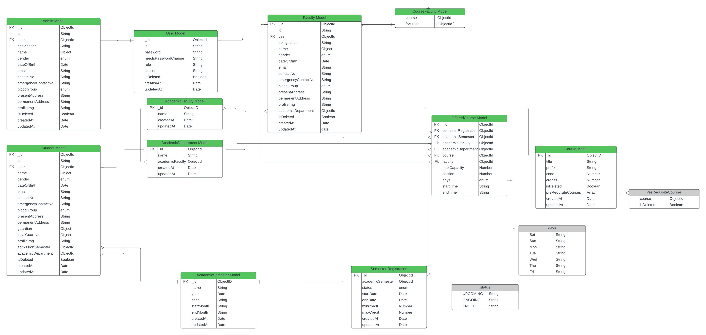

# **Academic Management System (Frontend)**  

This repository contains the frontend implementation for the Academic Management System, designed to streamline workflows for **administrators**, **faculty**, and **students** in an educational institution. It enables role-based management for user and course administration, academic scheduling, and course registration.  

---

## **Table of Contents**  
1. [Key Features](#key-features)  
   - [Role-Based Access Control](#1-role-based-access-control)  
   - [Comprehensive User Management](#2-comprehensive-user-management)  
   - [Academic Structure Management](#3-academic-structure-management)  
   - [Course and Semester Management](#4-course-and-semester-management)  
   - [Dynamic UI Components](#5-dynamic-ui-components)  
   - [State Management](#6-state-management)  
   - [Secure Authentication](#7-secure-authentication)  

2. [Installation and Setup](#installation-and-setup)  
   - [Prerequisites](#prerequisites)  
   - [Steps](#steps)  

3. [Links](#links)  

4. [Project Structure](#project-structure)  
   - [Directory Overview](#directory-overview)  

5. [Screenshots and Descriptions](#screenshots-and-descriptions)  
   - [Login Page](#1-login-page)  
   - [Dashboard](#2-dashboard)  
   - [Semester Management](#3-semester-management)  
   - [Faculty Management](#4-faculty-management)  
   - [Department Management](#5-department-management)  
   - [Student Management](#6-student-management)  
   - [Semester Registration](#7-semester-registration)  
   - [Create Course](#8-create-course)  
   - [Offer Course](#9-offer-course)
   - [Student Panel](#10-student-panel)

6. [Usage](#usage)  
   - [Authentication](#authentication)  
   - [Admin Features](#admin-features)  
   - [Faculty Features](#faculty-features)  
   - [Student Features](#student-features)  

7. [Core Technologies](#core-technologies)  

8. [Important Files](#important-files)  
   - [Entry Points](#entry-points)  
   - [Pages](#pages)  
   - [Redux](#redux)  

9. [ER Diagram Integration](#er-diagram-integration)  

10. [Future Enhancements](#future-enhancements)  

---

## **Key Features**

### 1. **Role-Based Access Control**
- **Admin**:
  - Manage users (admins, faculty, and students).
  - Oversee academic departments, faculties, and semesters.
  - Create and manage courses, assign them to faculties, and track registration.
- **Faculty**:
  - Manage assigned courses.
  - View and manage enrolled students.
- **Student**:
  - View course offerings.
  - Register for courses and view personalized schedules.

### 2. **Comprehensive User Management**
- Add, update, and delete users with role-based attributes.
- Assign academic roles and departments.
- Manage user authentication and access control using JWT.

### 3. **Academic Structure Management**
- Create and manage:
  - Academic faculties.
  - Academic departments.
  - Academic semesters (with start and end dates, min/max credits).

### 4. **Course and Semester Management**
- Administer course details, prerequisites, and assigned faculties.
- Track course offerings and semester registrations.
- Enable students to view and register for available courses.

### 5. **Dynamic UI Components**
- Modular and reusable UI components for forms, layouts, and dashboards.
- Custom date pickers, dropdowns, and time pickers integrated for seamless data entry.

### 6. **State Management**
- Centralized state management using Redux Toolkit for scalable and maintainable data flow.

### 7. **Secure Authentication**
- Implements login, logout, and token-based user authentication.

---

## **Installation and Setup**

### **Prerequisites**
- **Node.js**: Ensure Node.js (v16 or higher) is installed.
- **Package Manager**: npm or yarn.
- **Backend**: A running backend service (refer to the backend repository README for setup).

### **Steps**
1. **Clone the repository**:
   ```bash
   git clone https://github.com/mohamim360/academic-management
   cd academic-management-frontend
   ```

2. **Install dependencies**:
   ```bash
   npm install
   ```

3. **Configure environment variables**:
   Create a `.env` file in the root directory and add the following:
   ```env
   VITE_API_BASE_URL=https://academic-management-server.vercel.app/api
   ```

4. **Run the application**:
   Start the development server:
   ```bash
   npm run dev
   ```

5. **Build for production**:
   ```bash
   npm run build
   ```

6. **Lint and format code**:
   To ensure clean and consistent code:
   ```bash
   npm run lint
   ```

---

## **Links**

- **Frontend Repository**: [GitHub Link](https://github.com/mohamim360/academic-management)  
- **Backend Repository**: [GitHub Link](https://github.com/mohamim360/academic-management-server)  
- **Server Live Application**: [Visit Here](https://academic-management-server.vercel.app/)  

---

## **Project Structure**
The project is built using **React**, **TypeScript**, and **Vite**. The structure is modular and follows best practices for scalability, making it easy to extend and maintain.

### **Directory Overview**

#### `src`
- **`assets`**: Contains images and static assets (e.g., logos, icons).
- **`components`**:
  - **Form**: Contains reusable form elements like:
    - `PHDatePicker`: Date picker for forms.
    - `PHInput`: Standard text input field.
    - `PHSelect`: Dropdown selection component.
    - `PHTimePicker`: Time selection component.
  - **Layout**:
    - `AdminLayout`: Layout for admin pages.
    - `MainLayout`: General layout for the application.
    - `ProtectedRoute`: Handles route access based on authentication and roles.
    - `Sidebar`: Dynamic sidebar generation for role-based navigation.
- **`constants`**: Stores global constants (e.g., semester details).
- **`pages`**:
  - Contains all pages grouped by user roles and features:
    - **Admin**: Pages for managing users, academic structures, and courses.
    - **Faculty**: Pages for viewing assigned courses and students.
    - **Student**: Pages for course registration and schedules.
- **`redux`**:
  - **Hooks**: Contains custom Redux hooks.
  - **Store**: Centralized store configuration.
  - **Features**: Modular slices for different functionalities like:
    - Admin management (user, course, academic management).
    - Faculty and student-specific features.
    - Authentication (login/logout/token verification).
- **`routes`**: Centralized routing configuration for admin, faculty, and student roles.
- **`schemas`**: Form validation schemas for academic and course management.
- **`types`**: TypeScript type definitions for better type safety.
- **`utils`**: Utility functions for common tasks like route generation and sidebar configuration.

---

## Screenshots and Descriptions

### 1. **Login Page**
The login page provides a secure and user-friendly interface for authentication. Users enter their credentials (username/email and password) to log in. Role-based redirects ensure users access the correct dashboard based on their privileges (Admin, Faculty, or Student).

  
> **Key Features**:  
> - Secure authentication using JSON Web Tokens (JWT).  
> - Interactive form validation for better user experience.  
> - Role-based routing post-login.  

---

### 2. **Dashboard**
The dashboard serves as the central hub for the system, providing quick navigation to key features. Each user role (Admin, Faculty, and Student) has a customized dashboard layout tailored to their responsibilities.  

  
> **Key Features**:  
> - Displays summarized data, including notifications and action buttons.  
> - Role-specific navigation menu (e.g., user management for admins).  
> - Intuitive layout for a seamless user experience.  

---

### 3. **Semester Management**
The semester management module allows administrators to create and manage semesters effectively. Admins can define semester durations, credit limits, and other academic settings.

  
> **Key Features**:  
> - Form-based interface to add or edit semesters.  
> - Displays semester details like start/end dates and credit limits.  
> - Easy navigation to manage semester registrations and course offerings.  

  
> **Additional Features**:  
> - Lists all existing semesters with filtering and sorting options.  

---

### 4. **Faculty Management**
This module allows administrators to manage faculty records, including their assigned courses and departments. It simplifies tracking and updating faculty-related information.  

  
> **Key Features**:  
> - Intuitive form for adding new faculty members.  
> - Allows assignment of roles, courses, and departments.  
> - Real-time validation to avoid data entry errors.  

  
> **Additional Features**:  
> - Lists all registered faculty members with details.  
  
---

### 5. **Department Management**
The department management page enables administrators to oversee academic departments. Admins can add, update, or delete departments, ensuring organizational accuracy.

  
> **Key Features**:  
> - Simple interface to add or edit department names.  
> - Displays department details like faculty head and associated courses.  

  
> **Additional Features**:  
> - Comprehensive list of all departments with quick action buttons.  
> - Search and filter functionalities for better management.  

---

### 6. **Student Management**
The student management module provides an interface for adding and managing student details. Admins can assign students to specific departments and semesters, enabling accurate record-keeping.  

  
> **Key Features**:  
> - User-friendly form for adding new students with validation checks.  
> - Assign departments, semesters, and enrollment statuses.  

  
> **Additional Features**:  
> - Displays a list of all registered students with their academic details.  
> - Includes options for editing and removing student records.  

### 7. **Semester Registration**
The semester registration module enables students to register for courses offered in a specific semester. It integrates with the backend to ensure course prerequisites are met and credit limits are respected.

  
> **Key Features**:  
> - Displays available courses for the selected semester.  
> - Enforces credit limits and checks for prerequisites dynamically.  

---

### 8. **Create Course**
The create course module allows administrators to define new courses with detailed metadata. Courses can include prerequisites, assigned faculties, and associated departments.

  
> **Key Features**:  
> - Add course details, including course code, title, and credits.  
> - Set prerequisites by selecting other courses from the system.  
> - Assign faculties to courses and specify the target department.  
> - Form validation ensures accurate data entry.  

---

### 9. **Offer Course**
The offer course module allows administrators to make specific courses available for student registration in a semester. This links courses to a semester and manages faculty assignments.

  
> **Key Features**:  
> - List of all courses available in the system.  
> - Assign courses to a specific semester.  
> - Link faculty members to the offered courses for tracking purposes.  

### 10. **Student Panel**

The student panel provides a comprehensive view of enrolled courses, personalized schedules, and academic performance. This section ensures students can easily access their information and stay updated on their academic progress.

#### **My Schedule**
The "My Schedule" feature allows students to view their class schedule for the current semester. It provides details about course timings, instructors, and locations.

  
> **Key Features**:  
> - Displays a day-wise or weekly schedule of enrolled courses.  
> - Shows course details, including time, location, and instructor name.  
> - Helps students plan their academic and personal activities effectively.  

---

#### **Course Marks**
The "Course Marks" feature gives students access to their grades and progress in enrolled courses. It ensures transparency and allows students to track their academic performance throughout the semester.

  
> **Key Features**:  
> - Displays marks for assignments, quizzes, midterms, and final exams.  
> - Shows overall grades and performance summaries for each course.  
> - Integrated with backend APIs for real-time updates.  

---

## **Usage**

### **Authentication**
- Access different dashboards based on user roles.
- Secure login/logout using JWT.

### **Admin Features**
- Manage users:
  - Create, update, or delete admins, faculty, and students.
  - Assign academic roles and departments.
- Manage academics:
  - Add, update, or delete academic faculties, departments, and semesters.
- Manage courses:
  - Create new courses, set prerequisites, and assign faculties.
  - Track semester course offerings and registrations.

### **Faculty Features**
- View and manage courses assigned by admin.
- Manage student enrollments.

### **Student Features**
- View available courses for the semester.
- Register for courses and view schedules.

---

## **Core Technologies**

### **Frontend Stack**
- **React**: Component-based frontend framework.
- **TypeScript**: Adds type safety to JavaScript.
- **Redux Toolkit**: Simplified state management.
- **Vite**: Fast development server and build tool.
- **React Router**: Routing for multi-page navigation.

### **Styling**
- **CSS**: Included for basic styling, with potential integration of libraries like Tailwind or Material-UI.

---

## **Important Files**

### Entry Points
- **`App.tsx`**: Main entry point of the application.
- **`main.tsx`**: Initializes the app with React and Redux.

### Pages
- **Admin Pages**:
  - `AdminDashboard.tsx`: Overview of admin-specific features.
  - `AcademicDepartment.tsx`: Manage academic departments.
  - `CreateAcademicSemester.tsx`: Add new semesters.
- **Faculty Pages**:
  - `FacultyDashboard.tsx`: Overview of assigned courses.
  - `MyCourses.tsx`: Manage course content and enrolled students.
- **Student Pages**:
  - `StudentDashboard.tsx`: View schedule and semester progress.
  - `OfferedCourse.tsx`: Course registration interface.

### Redux
- **State Management**:
  - `authSlice.ts`: Handles authentication state.
  - `admin.api.ts`: Manages admin-related API calls (e.g., course creation).
  - `facultyCourses.api.ts`: Handles faculty-specific APIs.
  - `studentCourseManagement.api.ts`: Manages student course-related features.

---

## **ER Diagram Integration**
This frontend application integrates with the backend using the provided **ER Diagram**, which defines the relationships between users, courses, semesters, and academic entities. All API interactions align with these relationships for seamless integration.


---

## **Future Enhancements**
- **Real-Time Features**:
  - Add WebSocket support for notifications and live updates.
- **Enhanced UI/UX**:
  - Integrate advanced design frameworks (e.g., Material-UI or Chakra UI).
- **Data Analytics**:
  - Visual dashboards for admins to track academic progress.

---
